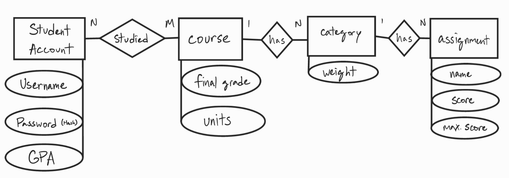
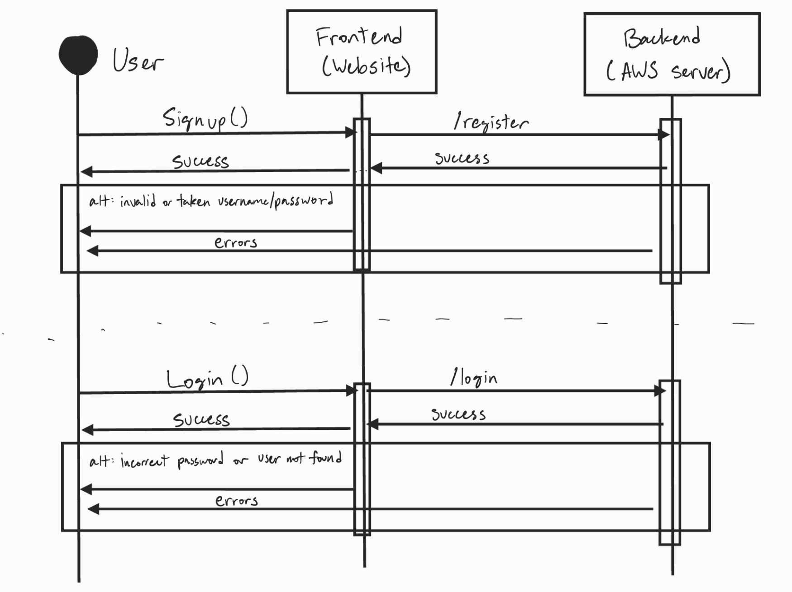

Hi! This is for the UCLA CS35L Final Project, hosted by Kevin Lao, Lauren Nguyen, Logan So, and Joseph . Below will be guides and notes before running this repository. The link to the website is https://kevlao1.github.io/finalGradeCalculator/#/login.

## Background information (Addressing the Rubric)
- This app uses the libraries and languages of JavaScript (both Node and React, with the appropriate CSS and HTML files) for the website, PostgreSQL for the database, and Python for backend logic. This build also uses a few .tsx files, converted to static JS files upon building the website via gh-pages.
- In order to provide security, this app requires a login in order to access the calculator. It utilizes the JWT token system, providing a temporary token to an ordinary user. Additionally, the password provided must meet the criteria for a secure password (8 characters minimum, at least one special character, at least one uppercase and one lowercase letter, and a number) and is hashed when stored during account creation via bcrypt.
- The website is currently running on an AWS server, which should provide approximately 24/7 coverage (until our free plan ends).
- The three big features that are present in this is the live GPA calculator which updates automatically alongside the course calculator when units for each class are inputted, the unique category weighting system present in the course calculator, and the grade visualizer.

# How To Run This App
## Note: This guide assumes that you have the following: Python 3.10+, Node.js v18+, PostgreSQL v14+. This is done best via VS Code.
This process has been streamlined for your convenience, with the necessary commands in either quotation marks or paranthesis. That being said, there are still a few steps to run this locally with complete functionality; you will need to do the following:
It is recommended that you have *two* terminals open; you will see why in a few steps.
1. Clone this repository and cd into the finalGradeCalculator directory. You should now see a few files and two folders: backend and docs. 
2. Set your current directory to be docs (via cd docs), then run "npm install". This downloads the necessary modules for the website UI to run.
3. Exit the docs folder back into the finalGradeCalculator. Now set up the virtual environment for Python by running "python3 -m venv .venv && source .venv/bin/activate && pip install -r requirements.txt". This installs all the required Python modules for the logic in the backend folder to run properly.
4. This program uses an SQL database, thus tables must be made. In order to do so, log into the PostgreSQL shell (psql postgres). After, these commands must be run (replacing <dev_user> with your username and <password> with your password): "CREATE DATABASE grade_calculator;", "CREATE USER <dev_user> WITH ENCRYPTED PASSWORD '<password>';", and "GRANT ALL PRIVILEGES ON DATABASE grade_calculator TO <dev_user>;". Exit the PostgreSQL shell (\q), then run "psql -h localhost -U <dev_user> -d grade_calculator -f grade.sql" to set up the tables. 
5. Create a new .env file in the backend folder named ".env", following the format provided in ".env.example" (also found in the backend folder). (If you are running this on a server, create another file in the docs folder named ".env.production" that is based off of ".env.productionexample". There also may be more quirks when running this on a server that is not AWS, so adapt accordingly.)
6. With all the necessary modules downloaded, we now have to start the website and back end. Enter the backend folder (cd backend) and run "python -m uvicorn app:app --host 127.0.0.1 --port 8000". This starts local port 8000 to run the Python server necessary for the database. Exit back to finalGradeCalculator then enter docs. Run "npm start". The website will open at port 3000 if it is free.
The app is now fully functional.

# How to run E2E tests
This is the guide to do the tests via commands:
1. npm install -D @playwright/test
2. npx playwright install
3. Run test in docs/tests
4. npm install
5. npx playwright test
The tests provided should run and pass.

# Notes
- The program automatically lowercases any and all usernames upon creation to avoid a bug. Usernames are also unique.
- In order for the .env files to work for this app, you may need to enable an option known as "python.terminal.useEnvFile". You can do this by opening VS Code settings and pasting "python.terminal.useEnvFile" into the search bar, then enabling the checkbox.
- For 24/7 activity, it is preferable to run this on a server. We used AWS for hosting, they have a good 6-month free plan.
- Due to the nature of .gitignore, any newly created .env file that *isn't* .env or .env.production will be saved in the repository. This can be rectified by including the line ".env*" in .gitignore.

# Diagrams
Below are two diagrams that attempt to summarize the data structure of the database and the account register and login functions.

This diagram relates a number of student accounts (with a username, password hash, and GPA) to a number of courses (with a final grade and units). Each course contains a number of categories containing a weight, with each category containing a number of assignments (with the assignment name, score, and maximum score).

This diagram tracks the behavior of each function relating to the sign-up and login of an account. 
For signing up, the user presses the button that sends Signup() to the website, which determines if the username and password combination are valid. If the password does not meet the specifications or if the username is invalid, the website will output an error; if no conditions are violated, the combination is sent to the server. The server checks if the same username is present: if it does, then it sends back an error to the website which outputs it. If not, it saves the password hashed alongside the username and assigns it an ID. The server then sends the successful code to the website, which outputs a successful creation.
For logging in, a similar process happens. The user presses the button that sends Login() to the website, which checks if either field is empty. If one is, the server sends an error; if neither are, the website sends it to the server, where the database checks for the username and compares the hashes. If the password is incorrect or if the username isn't found, the server sends an error code back to the website, which then outputs an error message. If one is found, then a JWT token is issued for the user, and a successful code is sent to the website, which outputs the successful login and redirects the user to the calculator.

# Depreciated Guides
## These guides were written earlier in the development process and should not be relied on for any work. However, you may find this helpful when trying to add onto this code, if the above guide is too confusing, or if you are interested in how ghfiles or virtual environments were used.

## Website notes
Read before doing *any* frontend/UI development.
1. We are using gh-files to run the website, meaning that you will need to install a package before editing and deploying the page. Whenever you can, go to your local repository files (most likely ending with ~/finalGradeCalculator), run "cd docs" and "npm install" to install the package locally. It is set up so that you only need to install the package once, and *locally*. Do not remove docs/node_modules/ in .gitignore unless if we are removing gh-files. (In the case where you do not run "cd docs", it will create a new package.json and package-lock.json file and a big folder called node-modules. *Delete all 3 of them, then reinstall in the docs directory.*) DO NOT CHANGE THE NAME OF DOCS UNLESS IF WE STOP USING GITHUB PAGES!
2. Since you guys are using .tsx files for the website, you will have to run a command for the code to compile the .tsx file for it to operate as a .js file, which is "npm run deploy". It will NOT build correctly if you do not run this command. The current homepage in package.json is set to https://kevlao1.github.io/finalGradeCalculator/#/login, but you should not have any issue running it locally even with that set. If you somehow see the build folder that is running the website, DO NOT EDIT ANYTHING INSIDE THE FOLDER! Instead, only directly edit the .tsx file then recompile with the same command.
~~3. Since GitHub Pages runs *only* the website and not the servers behind it, we will need to use another free service for data storage. I will look into it in a bit, but if not, the server will have to be one of our computers.~~

## Setting up a virtual environment:
Read before doing *any* backend development and tests locally.
1. Make sure that your local current repository is up-to-date; if it's not, save your work with "git add ." and "git commit" before running "git pull origin main" to get the newest main commit (assuming that your repository is already linked to the GitHub repository, which is an entirely separate thing with "git clone")
2. Run the command "python3 -m venv .venv" and "source .venv/bin/activate" to create and start running the virtual environment, respectively
3. Run the command "pip install -r requirements.txt" to automate the install process for all the modules required, it shouldn't take that long to download and you should be good to go (if you already set up a .venv/, then just do this step to update your modules)
4. Deactivation is done by running "deactivate". Reactivation is done via the same "source .venv/bin/activate" command, but without the reinstalling, since everything's already installed

## Some notes just in case:
1. The .gitignore file has .venv/ to prevent any installation of module files, do NOT remove it under any circumstances
2. I don't know if there are any modules for stuff outside Python, but currently the requirements.txt file only applies for Python modules 
3. This shouldn't really matter unless if you're running an *old* old version of Python, but it's currently set up for 3.12.2

## If you want to add a new Python module:
(This assumes that your original virtual environment has all the necessary modules to run it; if it does not, get it up-to-date first to make sure)
1. Code your implementation first, assuming you'll have all the functions of the module later on
2. Install the module in your virtual environment
3. Run "pip freeze > requirements.txt", this will capture all of the modules in the virtual environment into the requirements.txt file. Note that this will *overwrite* the file, so make sure you have all the necessary modules before overwriting it
4. Push and commit requirements.txt (and your modified code if it is ready) both locally *and* to GitHub.
(More guides/notes may be added based on necessity.)
